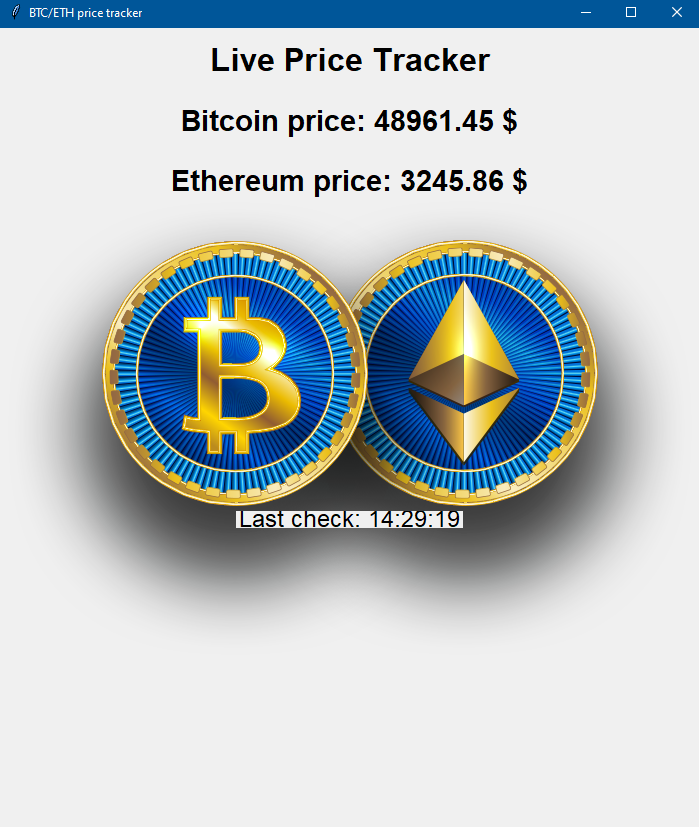

//////////////////////////////Апликација за приказ тренутних вредности криптовалута\\\\\\\\\\\\\\\\\\\\\\\\\\\\\\\\\\\\\\\

Графички интерфејс за апликацију развијен је коришћенјем библиотеке Tkinter.

Програм цита тренутне вредности преко API који се може наћи на линку 
<<<https://min-api.cryptocompare.com/documentation?key=Price&cat=multipleSymbolsFullPriceEndpoint>>>

Затим изабрани подаци за читанје, у овом случају, валуте и вредност у америчким доларима, се форматирају и прослеђују графичком интерфејсу.
Освежаванје вредности се извршава након 1 секунде.

У прилогу се налази изглед графичког интерфејса

